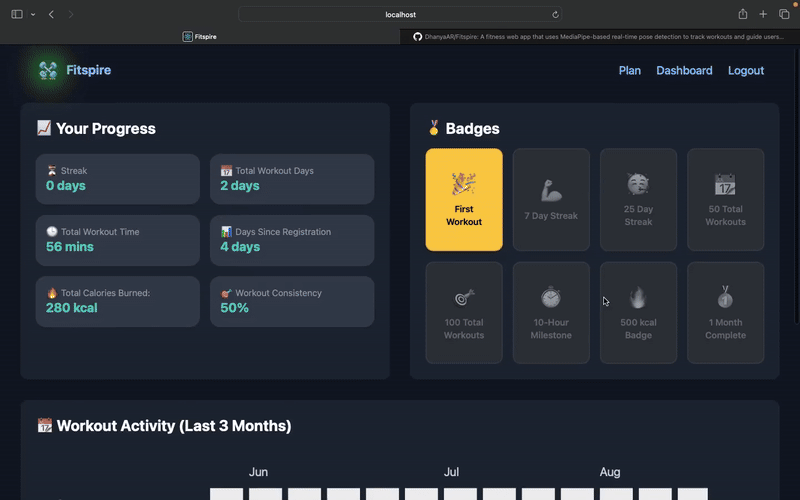
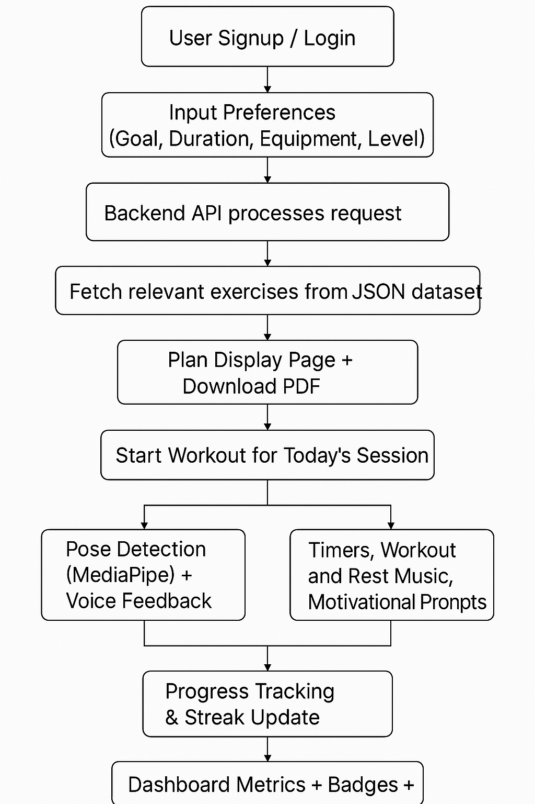

# Fitspire – Personalized Fitness App with AI Pose Detection

🔥 *One Goal. One Grind. One You.*

> **Your AI coach for personal, private, and powerful fitness sessions.**
> No trainers. No pressure. Just you, your space, and smarter workouts.

**FitSpire** is a smart fitness companion that designs a personalized 7-day workout plan based on your goals, equipment (home or gym), fitness level, and schedule — with a downloadable PDF version for offline use.

Using real-time **AI pose detection**, FitSpire gives **voice feedback** to guide your form as you move, just like a personal trainer would.

Track your progress with **workout streaks**, a **90-day heatmap**, **calorie stats**, **badges**, and an **intuitive timer** — all in one place.

Whether you're an introvert, a solo gym-goer, or just someone who prefers working out privately, **FitSpire brings the personal coach experience to your screen.**


## 🚀 Demo

#### 🎞️ Instant Preview  
Here's a short preview of FitSpire in action — from generating a 7-day plan to navigating the dashboard and starting your first workout.



#### 📺 Full Walkthrough  
**Watch the full experience** — including AI pose detection, voice feedback, and progress tracking here:  
[▶️ Watch on YouTube](https://www.youtube.com/watch?v=YOUR_VIDEO_ID)


## 💪 Key Features

### 🧠 Personalized 7-Day Workout Plan (Backed by Custom Exercise Dataset)
- User onboarding captures fitness level, equipment availability, time constraints, and fitness goals.
- Automatically generates a tailored 7-day plan by filtering from a custom-built dataset of 130+ exercises (JSON format with rich metadata like level, goal, muscle group, reps, rest, video, and images).
- Plans are stored and fetched from MongoDB for seamless login-based access.
- Downloadable PDF version of the workout plan for offline use.

### 📅 Smart Scheduling + Dynamic UI
- Displays workout list with image, description, sets, duration, and video links.
- "Start Workout" available only for the day’s scheduled session (`streak % 7 + 1`) to maintain discipline.

### 🎙️ Guided Workout Experience
- Starts with a 3-2-1 countdown voiceover followed by timer with motivational audio prompts mid-session.
- Integrated workout music player (toggleable), and a rest phase with calming audio + skip rest option.
- Paired with real-time progress bar, intuitive pause/resume/reset controls, and cinematic transitions between exercises.

### 🧍‍♂️ Pose Detection with Voice Feedback (Scalable)
- Integrated MediaPipe pose detection for 5 key exercises like Squats, Plank, Push-ups, Cobra Pose (Bhujangasana), and Warrior II (Virabhadrasana II).
- Gives real-time voice feedback like “Keep your back straight” or “Go lower.”

### 📈 Smart Dashboard
- Displays total workout days, streaks, calories burnt, total workout time, and workout consistency percentage.
- Tracks consistency and gamifies progress using badges (e.g. 7-day streak, 100-day milestone).
- Interactive heatmap showing workout activity over the past 90 days.

### 🔐 Auth System
- Simple signup/login with MongoDB session persistence.
- Logout functionality included for account security.


## 🛠️ Tech Stack

- **Frontend**: React.js (SPA), Tailwind CSS, JavaScript, Framer Motion  
- **Backend**: Node.js, Express.js (REST API)  
- **Database**: MongoDB  
- **Authentication**: MongoDB with session persistence  
- **AI/ML**: MediaPipe (Pose Detection)  
- **PDF Generation**: jsPDF, html2canvas  
- **Charts & Visuals**: React Calendar Heatmap  


## 🔁 System Flow 

The following diagram illustrates the end-to-end user journey in the Fitspire app — from signing up to tracking progress.




## ⚙️ Setup Instructions

```bash
# 1. Clone the repository
git clone https://github.com/DhanyaAR/Fitspire.git
cd Fitspire

# 2. Install frontend dependencies
npm install

# 3. Start the React frontend
npm start

# 4. Open a new terminal for backend
cd backend
npm install

# 5. Configure environment variables
# Create a .env file inside /backend with your MongoDB URI and PORT
touch .env
# Example .env:
# MONGO_URI=mongodb+srv://<username>:<password>@cluster.mongodb.net/fitspire
# PORT=5000

# 6. Start the backend server
node server.js
```


## 📸 Sample Screenshots

#### 🏁 Welcome Page  
Visually engaging landing page introducing FitSpire and prompting user to get started.


#### 🔐 Signup Page  
Authentication interface allowing users to create an account securely.


#### 📋 Workout Plan Display  
Auto-generated 7-day workout plan tailored to the user’s preferences, with YouTube video links of exercises and PDF download options.


#### 🏋️ Start Workout  
Real-time guided workout session with voice prompts, timer, progress bar, and pose detection.


#### 📊 Dashboard  
Tracks user's fitness journey with stats, heatmap, badges, streaks, and consistency metrics.


## 🚀 Future Improvements

- **Full Pose Detection Coverage**: Extend pose detection logic to support all 130+ exercises in the dataset.
- **Personalized Diet Plans**: Suggest daily diet with calories, macros, recipes, and YouTube tutorials.
- **Fitness Accessories Marketplace**: Add shopping tab for gear like protein powder, dumbbells, treadmill, etc.
- **Light/Dark Mode Toggle**: Let users switch between dark and light UI themes with gradient backgrounds.
- **Animated Workouts with GIFs**: Display exercise GIFs during sessions for better visual guidance.
- **Progress Analytics Dashboard**: Show weekly/monthly performance with graphs, charts, and insights.
- **Workout Reminders + Calendar Sync**: Send push reminders and sync with calendars for consistency.
- **Community Challenges & Leaderboards**: Encourage users with friendly fitness competitions and rankings.
- **AI Fitness Chatbot**: Add a chatbot to answer fitness and diet-related queries in real time.
- **Mobile App Version**: Launch dedicated Android and iOS apps for better accessibility.


## 👤 Contributors

- [@dhanyaar29](https://github.com/DhanyaAR) – Entire project ideation, design, development, and deployment.
> Built solo from scratch — from custom dataset design and backend logic to frontend UI/UX and ML integration.


